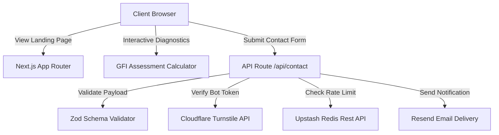

# North Star Advisory

A Next.js 16 executive landing platform and interactive lead-to-appointment diagnostic engine tailored for real estate investment firms, family offices, and asset managers operating across the GCC region.

## Overview

North Star Advisory delivers institutional diagnostic tools and advisory services for cross-border real estate asset managers. The platform features an interactive Growth Friction Index (GFI) assessment calculator that evaluates operational bottlenecks, quantifies efficiency losses, and provides actionable recommendations alongside a hardened corporate lead capture workflow.

## Key Features

- **Growth Friction Index (GFI) Diagnostic:** Dynamic 5-axis interactive self-assessment calculating operational efficiency, friction scores, and financial impact.
- **Institutional Service Offerings:** Detailed breakdowns of real estate deal sourcing, capital deployment, tech integration, and GCC regulatory compliance framework services.
- **Secure Lead Capture API:** Endpoint `/api/contact` handling client submissions with server-side validation and anti-spam verification.
- **Bot Mitigation & Rate Limiting:** Integrated Cloudflare Turnstile CAPTCHA verification and Upstash Redis rate limiting with fail-open fallback logic.
- **Transactional Notifications:** Resend API integration routing inbound inquiries to advisory partners.
- **Enterprise WCAG AA Accessibility:** Designed with keyboard navigation support, high-contrast visual tokens, and Low Power Mode CSS animation stability.

## Architecture



## Technical Stack

- **Framework:** Next.js 16 (App Router, Turbopack)
- **Language:** TypeScript 5.8
- **Styling:** Tailwind CSS 3.4, Framer Motion
- **State Management:** Zustand
- **Validation:** Zod
- **Rate Limiting:** Upstash Redis (`@upstash/ratelimit`, `@upstash/redis`)
- **Security:** Cloudflare Turnstile CAPTCHA
- **Email Service:** Resend API
- **Analytics:** Google Analytics 4, Microsoft Clarity
- **Testing:** Playwright (E2E Specifications)

## Project Structure

```
north-star-advisory/
├── app/                  # App Router routes (about, advisory-services, gcc-compliance, api/contact)
├── components/           # UI components, layout header/footer, and section modules
│   ├── sections/         # GrowthFrictionIndex, LeadCapture, Hero, CaseStudies
│   ├── navigation/       # Navbar and drawer components
│   └── ui/               # Reusable primitive tokens and animations
├── content/              # Static content definitions and case study data
├── lib/                  # Analytics, metadata generators, Zustand store, Zod schemas
├── public/               # Brand assets, static images, social media graphics
├── tests/                # Playwright E2E test suite (accessibility, form, navigation)
└── types/                # TypeScript type specifications
```

## Environment Variables

Copy `.env.example` to `.env.local` and specify your credentials:

```bash
cp .env.example .env.local
```

Required environment variables:

| Variable | Description |
| :--- | :--- |
| `RESEND_API_KEY` | Resend API authorization key for transactional email delivery |
| `NEXT_PUBLIC_TURNSTILE_SITE_KEY` | Cloudflare Turnstile public site key |
| `TURNSTILE_SECRET_KEY` | Cloudflare Turnstile secret validation key |
| `UPSTASH_REDIS_REST_URL` | Upstash Redis REST database URL for rate limiting |
| `UPSTASH_REDIS_REST_TOKEN` | Upstash Redis REST authorization token |
| `NEXT_PUBLIC_GA4_MEASUREMENT_ID` | Optional Google Analytics 4 tracking ID |
| `NEXT_PUBLIC_CLARITY_PROJECT_ID` | Optional Microsoft Clarity project ID |

## Running Locally

### Prerequisites

- Node.js `>= 20.0.0`
- npm `>= 10.0.0`

### Installation & Execution

1. **Install dependencies:**
   ```bash
   npm install
   ```

2. **Start development server:**
   ```bash
   npm run dev
   ```
   Open `http://localhost:3000` in your browser.

3. **Build for production:**
   ```bash
   npm run build
   npm run start
   ```

## Testing

Run Playwright end-to-end tests covering forms, responsiveness, accessibility, and navigation:

```bash
npx playwright test
```

## Engineering Highlights

- **Resilient Fail-Open Rate Limiter:** The Upstash Redis rate limiter in `/api/contact` handles network and DNS lookup timeouts gracefully by failing-open, ensuring legitimate corporate inquiries are never dropped during transient infrastructure issues.
- **Interactive State Calculation:** The Growth Friction Index calculates weighted scores dynamically on the client side using Zustand, supporting instant score recalculation without server round-trips.
- **Low Power Mode Animation Safe Guards:** CSS animations and transitions respect system accessibility settings (`prefers-reduced-motion`) and energy-saving states.

## Limitations & Future Improvements

- **Diagnostic PDF Generation:** Future releases will introduce automated server-side PDF report generation for calculated GFI scores, allowing users to download detailed PDF audit summaries.
- **CRM Integration:** Direct synchronization with enterprise CRMs (e.g., Salesforce or HubSpot) for automated deal-stage tracking.

## Author

Hamza Riadh Hattab

- **GitHub:** [https://github.com/Hamza-HATTAB](https://github.com/Hamza-HATTAB)
- **LinkedIn:** [https://www.linkedin.com/in/hamza-riadh-h-44a297345/](https://www.linkedin.com/in/hamza-riadh-h-44a297345/)

## License

This project is licensed under the MIT License.
